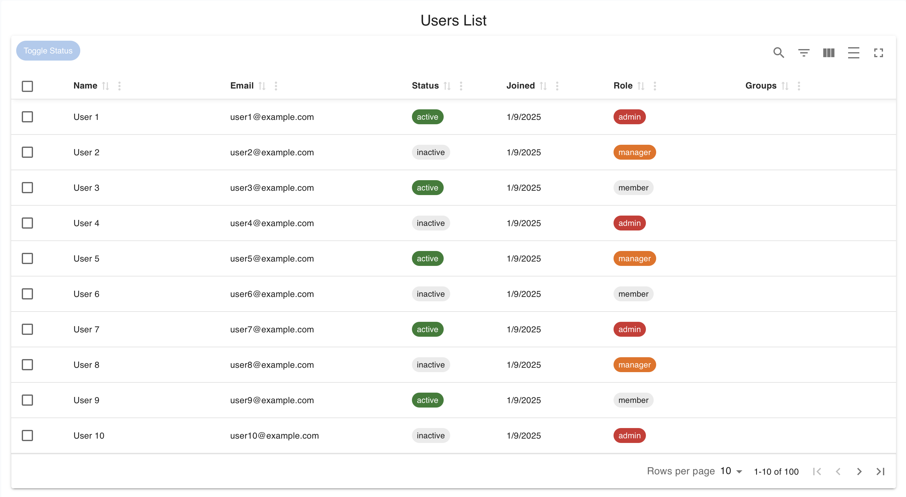
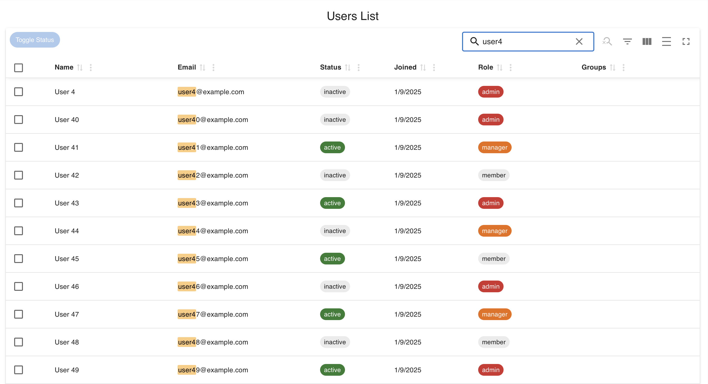
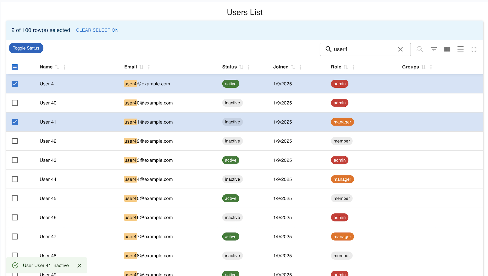
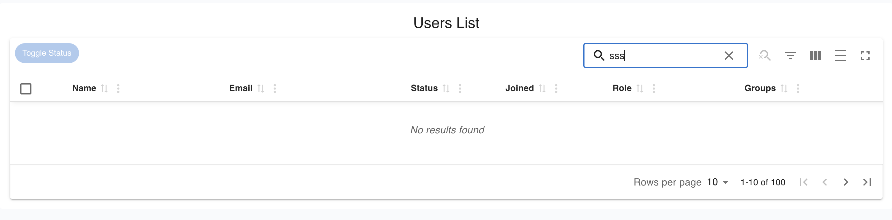
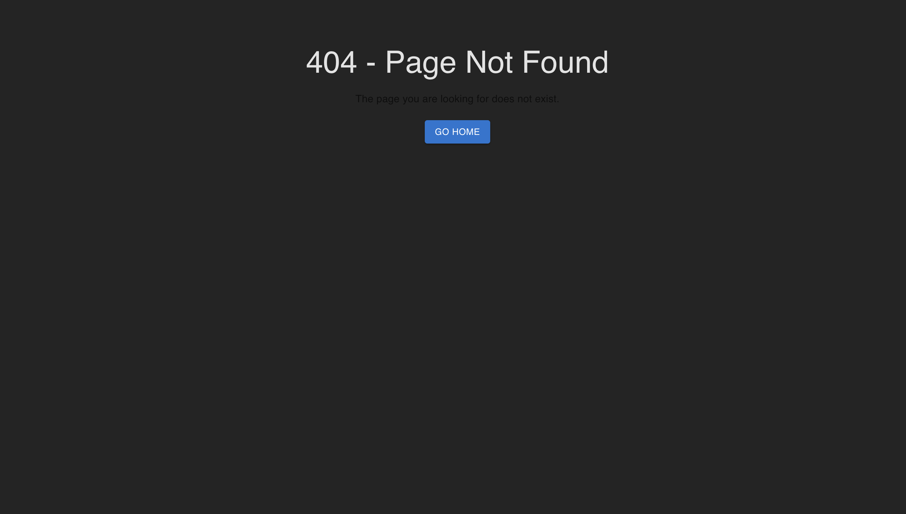

# Admin Dashboard – Users Page

A small Admin Dashboard built with React + TypeScript + Vite.
Implements a metadata-driven data grid using Material React Table (MRT), with mocked APIs via MSW.

---

## Demo

### 🎥 Video Demo 

## Demo

### 🎥 Video Demo  
[](https://github.com/user-attachments/assets/34298c55-27a3-49d8-abdc-559646563ebd)


## 🚀 Tech Stack

	•	React 18+ with TypeScript (strict mode)
	•	Vite for fast bundling
	•	Material UI + Material React Table (MRT)
	•	MSW (Mock Service Worker) for API mocking
	•	Axios for API requests
	•	ESLint + Prettier for linting/formatting

---

## ✨ Features

### Users Grid
	•	Metadata-driven columns
	•	Sorting, filtering, pagination (server-side via MSW)
	•	Row virtualization for performance

### Row Actions
	•	Row selection
	•	Toggle user status (Activate/Deactivate) with optimistic UI
	•	Snackbar feedback (success/error)
### Search
	•	Global search
	•	Per-column search filters
### 	UX
	•	Empty states (No users found)
	•	Loading skeletons + spinners
	•	Error boundary for safe rendering
	•	Accessible labels for actions


## Folder Strucutre 

```
src/
├── api/               # Axios API services
│   └── users.ts
├── assets/            # Static assets (images, demo video, icons, etc.)
│   └── images/
├── components/        # Reusable components
│   ├── errorBoundary.tsx
│   └── tables/
│       └── UsersTable.tsx
├── layouts/           # Layout wrappers
│   └── MainLayouts.tsx
├── mocks/             # MSW mock API setup
│   ├── browser.ts
│   ├── handlers.ts
│   └── server.ts
├── models/            # TypeScript models/types
│   └── types.ts
├── pages/             # Route-based pages
│   ├── NotFoundPage/
│   │   └── NotFoundPage.tsx
│   └── UsersPage/
│       ├── UsersPage.tsx
│       ├── UsersPage.module.css
│       └── UsersPage.test.tsx
├── utils/             # Helpers & utilities
├── App.tsx            # Root App
├── main.tsx           # Entry point
├── routes.tsx         # Central route config
├── setupTests.ts      # Vitest + RTL setup

```
### Installation
1. Clone the repository:
   ```bash
    git clone https://github.com/your-username/admin-dashboard.git
    
    cd admin-dashboard
    npm install  # Install dependencies
    npm run dev  # Run dev server
    npm run test # Run tests


## 🧪 Tests
	•	Renders Users List title
	•	Loads users from MSW
	•	Toggles user status with optimistic update + snackbar

## 🌍 Deployment

  This project is deployed at:
  👉 Live Demo on Vercel/Netlify

## 📸 Screenshots
### 1. Users List Page



### 2. Search in Action


### 3. Activate / Deactivate with Snackbar


### 4. Empty State


### 5. 404 Page


## 👤 Author

```
JeevanKumar R
📧 jeevankumar.krm@gmail.com
```
